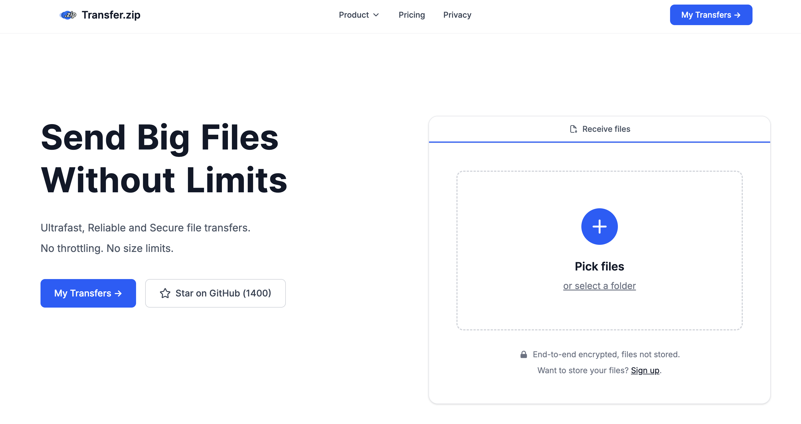

# Transfer.zip Clone

A minimal **Transfer.zip inspired file sharing app** built with **Next.js, TypeScript, Tailwind CSS, and GSAP**.  
Focused on clean UI, smooth animations, and real API-based file uploads.



## Tech Stack
- Next.js (App Router)
- TypeScript
- Tailwind CSS
- GSAP
- API Routes (File Upload)

## Features
- Modern landing page UI
- Click-to-upload files
- Secure API-based uploads
- Smooth GSAP animations

## Getting Started
```bash
npm install
npm run dev
